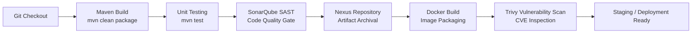

# Enterprise DevSecOps CI/CD Pipeline

<p align="center">
  
  
  
  
  
  
</p>

---

## 📌 Project Overview

This repository demonstrates an enterprise-grade **DevSecOps continuous integration and delivery (CI/CD) pipeline** built with **Jenkins**, **Maven**, **SonarQube**, **Sonatype Nexus**, **Docker**, and **Aqua Security Trivy**.

The pipeline establishes strict **quality gates** and **security scanners** directly in the build path. Artifacts are only packaged, versioned in Nexus, and converted into Docker images if they satisfy code quality requirements, passing unit tests, and vulnerability scanning thresholds.

---

## 🔄 DevSecOps Pipeline Architecture



---

## 🛡️ Pipeline Stages & Quality Gates

| Pipeline Stage | Tool | Execution Details & Security Benefit |
|---|---|---|
| **1. Source Checkout** | Git | Clones the designated branch from version control with clean working tree. |
| **2. Compilation & Build** | Apache Maven | Compiles source Java files and verifies project dependencies via `pom.xml`. |
| **3. Unit Testing** | JUnit / Maven | Executes test suites (`mvn test`) to catch functional regressions early. |
| **4. Code Quality & SAST** | SonarQube | Scans source code for bugs, code smells, vulnerabilities, and enforces quality gates (`withSonarQubeEnv`). |
| **5. Artifact Governance** | Sonatype Nexus | Deploys validated WAR/JAR artifacts into Nexus repository manager for immutable binary versioning. |
| **6. Containerization** | Docker | Packages application into a container image (`enterprise-devops-app:v1`). |
| **7. Container Security** | Aqua Trivy | Scans container image layers for OS package vulnerabilities (CVEs) and known dependency risks. |

---

## 📂 Repository Layout

```text
.
├── Jenkinsfile              # Declarative multi-stage DevSecOps pipeline
├── Dockerfile               # Container build instructions
├── pom.xml                  # Maven dependencies, plugins, and distribution management
├── src/                     # Java enterprise application source code
│   ├── main/                # Application business logic and web assets
│   └── test/                # Unit test specifications
└── .gitignore               # Build exclusion rules (target/, logs, temporary files)
```

---

## 🚀 Running the Pipeline Locally / On Jenkins

### Prerequisites
* Java JDK 17 & Apache Maven 3.9+
* Docker Engine 24+
* Running SonarQube Server & Sonatype Nexus instance
* Jenkins server with Maven, SonarQube Scanner, and Docker plugins installed

### Local Build & Test
```bash
# Compile and run unit tests
mvn clean test

# Run local SonarQube analysis (requires running SonarQube instance)
mvn sonar:sonar \
  -Dsonar.host.url=http://localhost:9000 \
  -Dsonar.login=<YOUR_SONAR_TOKEN>

# Build Docker container locally
docker build -t enterprise-devops-app:local .

# Scan image locally with Trivy
trivy image --severity HIGH,CRITICAL enterprise-devops-app:local
```

---

## 💡 Lessons Learned & Engineering Principles

1. **Shift-Left Security:** Catching security vulnerabilities during static code analysis (SonarQube) and image creation (Trivy) prevents high-severity CVEs from ever reaching runtime environments.
2. **Immutable Artifacts:** Storing versioned binaries in Sonatype Nexus ensures auditability and guarantees that testing and deployment occur on identical binary files.
3. **Automated Governance:** Gating deployment on SonarQube quality gate statuses prevents technical debt accumulation.
